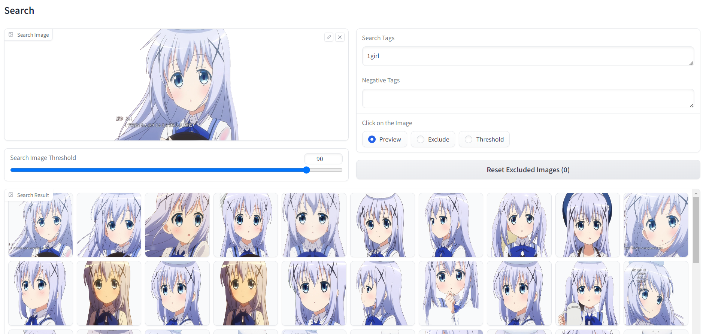

# chara-searcher

（[日本語版はこちら](README_ja.md)）



This is a repository for "character images search" from image and tags.

- Extract characters from multiple images or videos (background is automatically removed).
- You can search the extracted character images by image or tags.
- Search results can be exported and used as is for learning Stable Diffusion's Lora, etc.

## How to Install and Run

### Use standalone (recommended)

If you can use the conda command (Anaconda), you can install it with the command below.

```
conda create -n chara-searcher python=3.10
conda activate chara-searcher
conda install pytorch torchvision torchaudio pytorch-cuda=11.8 -c pytorch -c nvidia
python install.py
```

After installation, you can run it with the following command.

```
conda activate chara-searcher
python standalone_ui.py
```

If you don't use conda, run ``python install.py`` after installing Python  and pytorch (and cuda).   
How to install pytorch is [HERE](https://pytorch.org/get-started/locally/).   
After installation, you can run it with ``python standalone_ui.py``.

### Install on Stable Diffusion web UI

1. Start webui and enter the following URL from "Install from URL" in "Extensions" to install.
```
https://github.com/NON906/chara-searcher.git
```

2. Click "Apply and restart UI" under "Extensions" -> "Installed", and restart.

## How to Use

1. Click "Upload Images Directory" (for image directories) or "Upload Video File" (for video files) and upload the file(s) to be searched.    
After that, character extraction (background deletion), tagging, and vectorization for similar image searches will be automatically performed (please note that this may take some time).

2. Select the datas to search in "Target Datas".

3. You can search by specifying the following items.
- Search Image
- Search Image Threshold: Similarity to display (hidden if lower)
- Search Tags: Comma separated
- Negative Tags: Comma separated

4. After setting the following items, click on the search results to narrow down the search results.
- Click on the Image
  - Exclude: Click on the image to hide it (you can reset it with "Reset Excluded Images")
  - Threshold: Change "Search Image Threshold" to the value of the image you clicked

5. Set the following items and click "Export" to export the displayed images.
- Export Directory
- Additional Tags: Comma separated
- Exclude Tags