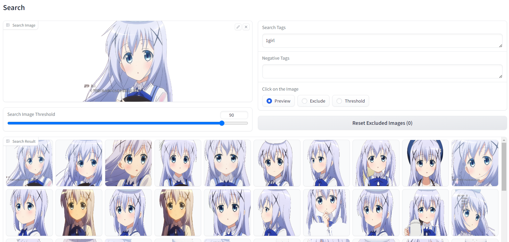

# chara-searcher



画像やタグからキャラクター画像検索を行うリポジトリです。

- 任意の複数枚の画像、もしくは動画から、キャラクターを抽出します（背景は自動で除去されます）
- その抽出したキャラクター画像を、画像やタグで検索できます
- 検索結果はエクスポートでき、そのままStable DiffusionのLora学習などに使用できます

NOTE:  
[DuckDuckGo](https://duckduckgo.com/)の画像検索に対応した開発版のブランチを追加しました。  
詳細は[こちら](https://github.com/NON906/chara-searcher/blob/duckduckgo/README_ja.md)を確認してください。  

## インストール・実行方法

### 単独で使用する

condaコマンド（Anaconda）を使用できる場合は、以下のコマンドでインストールできます。

```
conda create -n chara-searcher python=3.10
conda activate chara-searcher
conda install "pytorch<=2.1" torchvision torchaudio pytorch-cuda=11.8 -c pytorch -c nvidia
python install.py
```

インストール後は以下のコマンドで実行できます。

```
conda activate chara-searcher
python standalone_ui.py
```

condaを使用しない場合は、Python本体とpytorch（とcuda）をインストールした後に、``python install.py``を実行してください。  
なお、pytorchのインストール方法は[こちら](https://pytorch.org/get-started/locally/)を確認してください。  
インストール後は``python standalone_ui.py``で実行できます。

### Stable Diffusion web UIにインストールする

1. webuiを起動し、「拡張機能(Extensions)」の「URLからインストール(Install from URL)」から以下のURLを入力し、インストールしてください。
```
https://github.com/NON906/chara-searcher.git
```

2. 「拡張機能(Extensions)」の「インストール済(Installed)」の「適用してUIを再起動(Apply and restart UI)」をクリックし、再起動してください。

## 使用方法

1. 「Upload Images Directory」（画像ディレクトリの場合）もしくは「Upload Video File」（動画ファイルの場合）をクリックし、検索対象のファイルをアップロードしてください。  
その後、自動で、キャラクターの抽出（背景の消去）・タグ付け・類似画像検索用のベクトル化を行います（時間がかかるので注意してください）。

2. 「Target Datas」で検索対象のデータを選択してください。

3. 以下の項目を指定すると検索できます。
- Search Image: 類似画像検索対象の画像
- Search Image Threshold: 表示する類似度（下回ると非表示）
- Search Tags: タグ検索用のキーワード（カンマ区切り）
- Negative Tags: 除外するキーワード（カンマ区切り）

4. 以下の項目を設定後、検索結果をクリックすると絞り込みが出来ます。
- Click on the Image
  - Exclude: 画像をクリックすると非表示になります（「Reset Excluded Images」でリセットできます）
  - Threshold: 「Search Image Threshold」をクリックした画像の値に変更します

5. 以下の項目を設定し、「Export」をクリックすると表示されている画像のエクスポートが出来ます。
- Export Directory: エクスポート先のディレクトリ
- Additional Tags: 追加するタグ（カンマ区切り）
- Exclude Tags: 削除するタグ